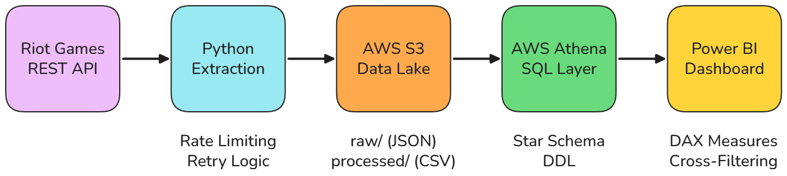
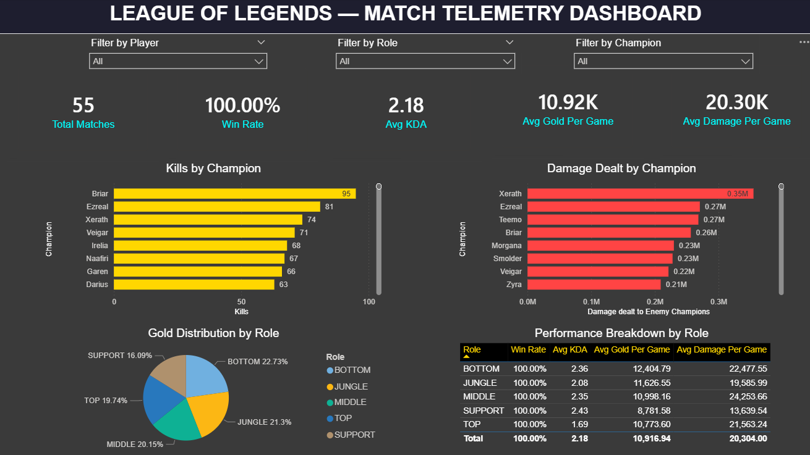

# League of Legends — Automated Telemetry Pipeline & Analytics Dashboard



## Overview

An end-to-end **Data Engineering** pipeline that extracts deeply nested match 
telemetry data from the **Riot Games REST API**, lands it in an **AWS S3 Data Lake**, 
models it into a **Star Schema** via **AWS Athena**, and serves it to an interactive 
**Power BI** dashboard for KPI tracking and player performance analysis.

This project demonstrates:
- Complex JSON parsing and flattening into relational models
- API rate-limit handling with retry/backoff logic
- Cloud-native architecture (S3 + Athena)
- Infrastructure as Code (Terraform)
- Advanced DAX measures in Power BI
- CI/CD with GitHub Actions

## Dashboard

### Static View


### Interactive Demo


**Key DAX Measures:**
| Measure | Formula Logic |
|---|---|
| Win Rate | `CALCULATE(DISTINCTCOUNT(match_id), win = TRUE) / DISTINCTCOUNT(match_id)` — Correctly handles the 10-player-per-match structure |
| Avg KDA | `(Kills + Assists) / Deaths` — Universal performance metric |
| Avg Gold Per Game | `SUM(gold_earned) / COUNTROWS(table)` — Resource generation efficiency |
| Avg Damage Per Game | `SUM(damage) / COUNTROWS(table)` — Combat output metric |

## Architecture

| Layer | Technology | Description |
|---|---|---|
| **Ingestion** | Python, Requests | OOP extractor with rate-limit handling and multi-pass player discovery |
| **Storage** | AWS S3 | Raw JSON (Bronze) and Processed CSV (Silver) zones |
| **Modeling** | AWS Athena | Serverless SQL layer with Star Schema DDL |
| **Visualization** | Power BI | Interactive dashboard with DAX, slicers, and cross-filtering |
| **Infrastructure** | Terraform | S3 bucket, IAM user, and Athena resources as code |
| **CI/CD** | GitHub Actions | Automated linting (Flake8) and unit testing (PyTest) on every push |

## Data Model

The raw JSON payloads (~10,000+ lines per match) are flattened into a single 
fact table optimized for analytical queries:

**`fact_match_participant`** — One row per player per match

| Column | Type | Description |
|---|---|---|
| `match_id` | string | Unique match identifier |
| `patch_version` | string | Game version (e.g., 16.8) |
| `game_duration_sec` | int | Match length in seconds |
| `puuid` | string | Player unique identifier |
| `riot_id` | string | Player display name |
| `champion_name` | string | Champion played |
| `team_position` | string | Role (TOP, JUNGLE, MIDDLE, BOTTOM, SUPPORT) |
| `win` | boolean | Whether the player's team won |
| `kills` | int | Total kills |
| `deaths` | int | Total deaths |
| `assists` | int | Total assists |
| `total_damage_dealt_to_champions` | int | Damage output |
| `gold_earned` | int | Gold income |
| `vision_score` | int | Map awareness metric |

## Tech Stack

`Python` · `Pandas` · `Boto3` · `AWS S3` · `AWS Athena` · `Power BI` · `DAX` · `Terraform` · `GitHub Actions` · `PyTest`

## How to Run

### Prerequisites
- Python 3.9+
- AWS Account (Free Tier)
- [Riot Developer API Key](https://developer.riotgames.com/)
- Power BI Desktop
- Terraform (optional, for IaC)

### 1. Clone & Install
```bash
git clone https://github.com/JoeAlexBV/lol-data-pipeline.git
cd lol-data-pipeline
pip install -r requirements.txt
```

### 2. Configure Environment

Create a .env file in the root directory:
```text
RIOT_API_KEY=RGAPI-xxxxxxxx-xxxx-xxxx-xxxx-xxxxxxxxxxxx
AWS_ACCESS_KEY_ID=AKIAxxxxxxxxxxxxxxxx
AWS_SECRET_ACCESS_KEY=xxxxxxxxxxxxxxxxxxxxxxxxxxxxxxxxxxxxxxxx
S3_BUCKET_NAME=your-bucket-name
```

### 3. Run the Pipeline
```bash
# Extract match data from Riot API
python src/extract_riot_data.py

# Transform raw JSON into flat CSV
python src/transform_riot_data.py

# Load to AWS S3
python src/load_to_s3.py
```

### 4. Set up Athena
Run the SQL in sql/create_athena_table.sql in the AWS Athena Query Editor.

### 5. Connect Power BI
Connect Power BI Desktop to AWS Athena using the Simba ODBC driver.
See AWS [Athena ODBC Documentation](https://docs.aws.amazon.com/athena/latest/ug/connect-with-odbc.html)

### 6. Optional - Provision Infrastructure
```bash
cd infrastructure
terraform init
terraform plan
terraform apply
```

## Testing

```bash
pytest tests/ -v
```

## Project Structure

```text
├── .github/workflows/    # CI/CD pipeline
├── infrastructure/       # Terraform IaC
├── sql/                  # Athena DDL
├── src/                  # Python ETL scripts
├── tests/                # Unit tests
├── docs/                 # Screenshots & diagrams
├── .gitignore
├── requirements.txt
└── README.md
```

## License

This project is for educational and portfolio purposes.
Riot Games data used under the [Riot Developer API Terms](https://developer.riotgames.com/terms)